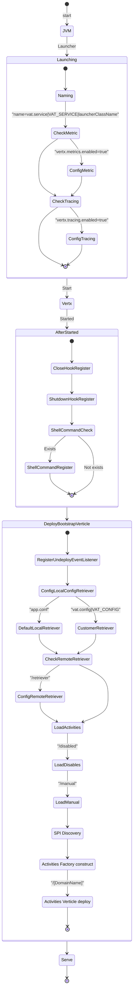

# VAT bootstrap sequence

## Launch process

```mermaid
stateDiagram-v2
    [*] --> JVM: start
    JVM --> Launching: Launcher
    state Launching {
        [*] --> Naming
        Naming --> CheckMetric: "name=vat.service|VAT_SERVICE|launcherClassName"
        CheckMetric --> ConfigMetric: "vertx.metrics.enabled=true"
        CheckMetric --> CheckTracing
        ConfigMetric --> CheckTracing
        CheckTracing --> ConfigTracing: "vertx.tracing.enabled=true"
        CheckTracing --> [*]
        ConfigTracing --> [*]
    }
    Launching --> Vertx: Start
    Vertx --> AfterStarted: Started
    state AfterStarted {
        [*] --> CloseHookRegister
        CloseHookRegister --> ShutdownHookRegister
        ShutdownHookRegister --> ShellCommandCheck
        ShellCommandCheck --> ShellCommandRegister: Exists
        ShellCommandRegister --> [*]
        ShellCommandCheck --> [*]: Not exists
    }
    AfterStarted --> DeployBootstrapVerticle
    state DeployBootstrapVerticle {
        [*] --> RegisterUndeployEventListener
        RegisterUndeployEventListener --> ConfigLocalConfigRetriever
        ConfigLocalConfigRetriever --> CustomerRetriever: "vat.config|VAT_CONFIG"
        ConfigLocalConfigRetriever --> DefaultLocalRetriever: "app.conf"
        DefaultLocalRetriever --> CheckRemoteRetriever
        CustomerRetriever --> CheckRemoteRetriever
        CheckRemoteRetriever --> ConfigRemoteRetriever: "/retriever"
        ConfigRemoteRetriever --> LoadActivities
        CheckRemoteRetriever --> LoadActivities
        LoadActivities --> LoadDisables: "/disabled"
        LoadDisables --> LoadManual: "/manual"
        state "SPI Discovery" as SPI_D
        LoadManual --> SPI_D
        state "Activities Factory construct" as AFC
        state "Activities Verticle deploy" as AVD
        SPI_D --> AFC
        AFC --> AVD: "/[DomainName]"
        AVD --> [*]
    }
    DeployBootstrapVerticle --> Serve
    Serve --> [*]
```
